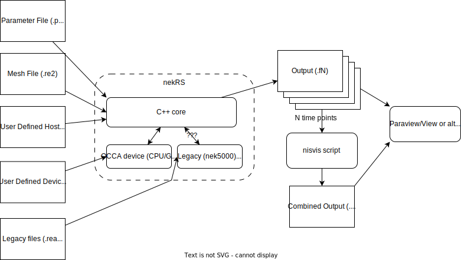

.. _user:

User guide
==========

This section:

* Explains the high level structure of nekRS 
* Instructs how to acquire, compile and run nekRS
* Provides an explanation of the different input and output files used by nekRS

This is all done from a user perspective which will be applicable to most people
interested in nekRS. If you wish to view information relevant to developing 
nekRS and contributing changes please look at the :ref:`developer`.

.. toctree::
    :maxdepth: 2
    
    compiling
    input_files
    commonly_used_variables
    detailed_usage
    plugins
    just_in_time_compilation